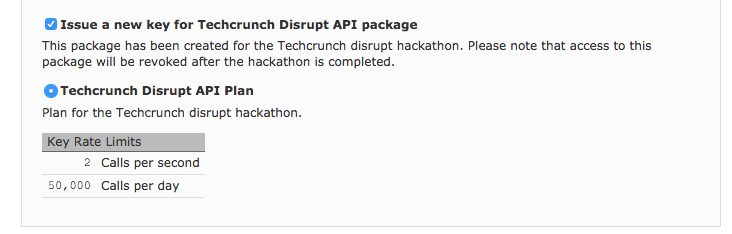

***
# NOTICE:

## This repository has been archived and is not supported.

[](http://unmaintained.tech/)
***
NOTICE: SUPPORT FOR THIS PROJECT HAS ENDED 

This projected was owned and maintained by Walmart. This project has reached its end of life and Walmart no longer supports this project.

We will no longer be monitoring the issues for this project or reviewing pull requests. You are free to continue using this project under the license terms or forks of this project at your own risk. This project is no longer subject to Walmart's bug bounty program or other security monitoring.


## Actions you can take

We recommend you take the following action:

  * Review any configuration files used for build automation and make appropriate updates to remove or replace this project
  * Notify other members of your team and/or organization of this change
  * Notify your security team to help you evaluate alternative options

## Forking and transition of ownership

For [security reasons](https://www.theregister.co.uk/2018/11/26/npm_repo_bitcoin_stealer/), Walmart does not transfer the ownership of our primary repos on Github or other platforms to other individuals/organizations. Further, we do not transfer ownership of packages for public package management systems.

If you would like to fork this package and continue development, you should choose a new name for the project and create your own packages, build automation, etc.

Please review the licensing terms of this project, which continue to be in effect even after decommission.

Getting Started with the WalmartLabs API
========================================

So you want to have some fun with the WalmartLabs API in
Javascript or Node. Cool. Here is what you need to do.
First, you need to [get an API key](https://developer.walmartlabs.com/member)
if you don't have one already.

If you are at TechCrunch be sure to check the TechCrunch
plan box as you request the key:



If you don't see the registration email in a minute or two check
your Spam folder.

With that in hand you are all ready to dig in. If you're like
all, "just give me the API I got this", then just:

```
npm install walmart --save
```

In your project. You can find the [code in Github](https://github.com/walmartlabs/walmart-api)
with some docs, examples, tests and the usual such and such.

The APIs themselves are [documented on the WalmartLabs developer API site](https://developer.walmartlabs.com/docs). But it's not exactly rocket science; get an item, lookup by UPC, search, stores by GPS coordinate.
The usual suspects.

Now, if you are all like, "meh, I'd be cool with a starter project", then
we have four to suit:

* [Starting with Express](https://github.com/walmartlabs/express-example)
* [Starting with HAPI](https://github.com/walmartlabs/hapi-example)
* [Starting with Cordova](https://github.com/walmartlabs/cordova-starter-kit)
* [Starting with React-Native](https://github.com/walmartlabs/react-native-starter)

All of these examples are designed to be *bare bones*. We don't give you
CSS, or almost any JS beyond some very simple jQuery stuff. So you're not
going to have to hack away a lot of bloat-ware just to get to the three
lines you actually need.

## E-Receipts

Also supplied in this repo are some example anonymized e-receipts that you
can play with as well as the UPC frequency counts. We are excited to see
what you can come up with from this data.

## Good luck!

Best of luck, friends. Stay frosty! If you need help you can
[contact us](https://developer.walmartlabs.com/contact) or
hit us up on [the boards](https://developer.walmartlabs.com/forum).
